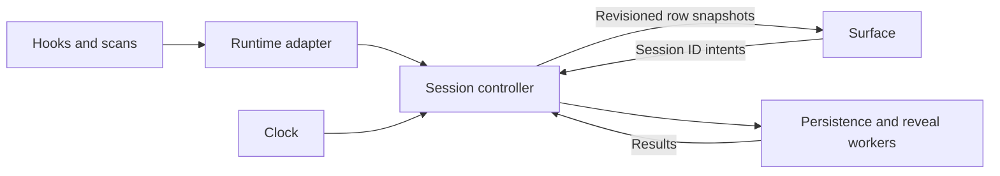

# Architecture hardening plan

Status: **proposed**. Reviewed against `330d495` on 2026-09-14. This
document records findings, implementation stages, and acceptance tests;
the proposed components and guarantees are not implemented by this PR.

## Scope

Improve the reliability of Phase 1 observation while retaining the small
native shim, one Tauri application, and daemon-owned session state.
The [architecture](ARCHITECTURE.md), [adapter protocol](ADAPTER_PROTOCOL.md),
[security model](SECURITY_MODEL.md), and [decisions](DECISIONS.md) remain
the sources of truth. Existing status meanings and interaction rules
continue to apply, including the recorded drag-bar exception.

The work introduces no approval, prompt-sending, interruption, or hosted
session capability. Future permission handling must still fail to `ask`.
Observation uncertainty remains `unknown`, with explanatory metadata;
it does not add a state or repurpose a colour.

The [OpenAI integration plan](OPENAI_INTEGRATION_PLAN.md) already proposes
adapter extraction. The stages here supply reliability prerequisites
for that boundary on the current Claude implementation. They do not
add another runtime or expand that plan's product scope.

## Evidence and limits

The review baseline passed 153 Rust tests, 36 surface tests, and the
production TypeScript no-emit check. Those results describe `330d495`,
not completion of the acceptance tests proposed below. Review scratch
harnesses exercised the production registry and state-machine modules;
they are not committed regression tests. Live GUI focus behavior was
not exercised during this review.

The four implementation comments on
[PR #10](https://github.com/owenpkent/deckhand/pull/10)
cover these confirmed paths:

| Finding | Evidence |
| --- | --- |
| Selection and reveal resolve different sessions | With bindings A, B, C, select B by index, remove A, then resolve reveal by that index: the request targets C. See [surface](../app/ui/src/main.ts) and [commands](../app/src-tauri/src/main.rs). |
| Resume keeps the old PID | Enumerate PID 111, end and resume the same ID, then enumerate PID 222: [registry](../app/src-tauri/src/registry.rs) retains 111. |
| Reveal blocks the surface | The synchronous Tauri command calls the polling sleep in [run_code_cli](../app/src-tauri/src/reveal.rs). Installed Tauri source confirms the caller runs on the IPC/event thread. |
| Hook commands fail on spaces | An isolated [installer](../scripts/install-hooks.ps1) probe stored an unquoted path containing spaces; shell execution treated the first segment as the executable and failed. |

The architecture review reproduced one additional correctness defect in
[state.rs](../app/src-tauri/src/state.rs):

1. Start children A and B, then receive the parent's `Stop`.
2. Receive `SubagentStop(A)`. B remains live and the parent is thinking.
3. Deliver `SubagentStop(A)` again.
4. The unmatched-ID fallback removes B and makes the parent complete,
   although no stop for B was received.

The remaining risks below are supported by source inspection, without
claims of measured production latency or live failure frequency:

- [Enumeration](../app/src-tauri/src/enumerate.rs) drops malformed rows
  but still returns a successful batch used for pruning. Its subprocess
  has no deadline, so a hung invocation prevents subsequent scans.
- [HTTP ingestion](../app/src-tauri/src/http.rs) reads an unlimited body
  on its request loop and ignores enqueue failure before returning 204.
- [Application wiring](../app/src-tauri/src/main.rs) uses an unbounded
  event queue and writes bindings under the registry mutex after ordinary
  state changes.
- [Persistence](../app/src-tauri/src/persist.rs) publishes and removes a
  shared contact file without instance ownership and uses direct writes.
- The [pipeline test](../app/src-tauri/tests/pipeline.rs) recreates the
  apply loop instead of exercising the production coordination path.

## Proposed ownership

One production `SessionController` owns mutations. Adapters, timers,
workers, and the surface provide inputs; external effects run after
the controller has produced owned data and released any state guard.

This can begin as library modules in the existing daemon crate. It does
not require another process, a plugin loader, a database, or a durable
event log. Preserve the current testable geometry and matching helpers.

## Implementation stages

### H0: Correct the known identity and duplicate-delivery defects

Priority: first. Effort: small fixes with targeted regression tests.

- Close operations and children by their supplied identities. A repeated
  stop for an already-closed ID is a no-op. Missing identity must follow
  an explicit conservative policy instead of consuming an unrelated
  identified operation. Keep uncertainty visible when exact recovery is
  impossible.
- Address the four PR review comments: stable session IDs across clicks
  and notes, refreshable process identity on resume, background reveal,
  and shell-safe installer commands with legacy-entry migration.
- Preserve the existing rule that a lagging scan cannot rebind an ended
  session merely because its old row still appears.

Acceptance: commit the duplicate-child sequence above; duplicate tool
start/finish cases; removal before and during activation; same-ID resume
with a replacement PID; delayed reveal results; and installer execution,
repeat-install, migration, and uninstall under paths containing spaces.

### H1: Extract the production controller and explicit effects

Priority: next. Effort: medium, touching application wiring and tests.

- Move mutation coordination out of `main.rs`. The controller receives
  observation, scan, tick, activation, and settings inputs through one
  ordered mutation path. UI-facing requests remain asynchronous.
- Produce a change set containing an owned view snapshot, persistent
  binding changes, desired row count, or a reveal request as needed.
  Do not retain a registry guard across I/O, main-thread dispatch, or
  an await. Put selection and reveal-request capture in one mutation.
- Persist only when persistent data changed. A status-only hook should
  not rewrite the binding file. Coalesce superseded snapshot, resize,
  and save effects by revision, while preserving required input events.
- Inject a clock. Use monotonic elapsed time for deadlines and keep
  wall-clock timestamps for display and source metadata.

Acceptance: the integration test calls this production controller.
A blocked fake persister or reveal executor must not block another
mutation or snapshot request. Effect ordering and binding-dirty behavior
are asserted, including bursts of hooks and a concurrent scan result.

Tradeoff: explicit effect data adds a mapping layer, but gives one place
to enforce the lock, scheduling, and persistence rules now scattered
across threads and commands.

### H2: Normalize events and represent scan authority

Priority: after H1, with H0 regressions retained. Effort: medium.

- Put Claude-specific JSON interpretation in an adapter module yielding
  typed observation events. Include session identity, operation identity,
  source, and receipt time. Preserve runtime observation timestamps and
  causal IDs when supplied; represent their absence explicitly.
- Do not invent causal order from arrival time or a locally assigned
  sequence. Apply stale-event checks where evidence supports them and
  test a conservative policy where it does not.
- Return `Complete`, `Partial`, or `Failed` enumeration results, with
  diagnostics. Parse only recognized schemas. Partial scans may add or
  refresh attributable rows; only a validated complete scan may prune.
- Track last hook, last successful complete scan, and observation-loss
  reasons independently. Never infer disabled hooks from silence alone.
  Project uncertainty into the existing `unknown` state and wording.

Acceptance: mixed valid/malformed rows, an unrelated wrapper array,
duplicate session IDs, total schema mismatch, delayed lifecycle events,
duplicate observations, and independent hook/scan failures. An incomplete
scan must never remove a session solely because its row failed parsing.

Tradeoff: uncertain scans can retain stale rows longer. That is preferable
to presenting incomplete discovery as evidence that a live session ended.

### H3: Separate session, process, and view identity

Priority: after controller extraction. Effort: medium.

- Use a stable session key, capable of including an adapter namespace,
  for registry identity, selection, commands, and row notes. Derive row
  positions for presentation only.
- Represent a live process separately from its logical session. Refresh
  PID metadata and use process-start evidence when available to distinguish
  a resumed process from a lagging report or PID reuse. A daemon restart
  does not make persisted bindings authoritative live-state evidence.
- Introduce a minimal `SessionRowView` instead of serializing the full
  `Session`, child ledger, operation details, and unused question data.
  Include only fields consumed by the surface.
- Add a daemon instance ID and increasing snapshot revision. Handle
  bootstrap, newer events, and instance replacement explicitly so an
  older response cannot replace newer state. Keep full snapshots until
  measurement justifies a more complicated transport.
- Migrate persisted binding identity while continuing to load existing
  ordered bindings and the supported legacy null-slot format.

Acceptance: row churn preserves selection and notes; delayed initial
snapshots cannot overwrite newer ones; instance replacement resets the
revision domain; resume refreshes process identity; and legacy bindings
load with the same labels and order. Contract-test Rust-serialized row
views against the surface's expected shape.

### H4: Isolate host resolution and reveal execution

Priority: after H0 background execution and H3 identity. Effort: medium.

- Separate gathering host evidence, resolving a target, and executing
  a raise. Keep process-tree, lock-file, window-title, and CLI assumptions
  inside the host integration boundary.
- Return a typed result such as `Raised`, `NotFound`, or `Ambiguous`,
  with session identity and safe diagnostic metadata. The surface formats
  text rather than parsing English sentences to decide success.
- Preserve accepted matching policies and ambiguity behavior. Any change
  to those product decisions follows the decision process separately.
- Run blocking work outside the event thread, serialize process-global
  console attachment, and define ordering for multiple activation
  requests so a delayed older result cannot override a newer action.

Acceptance: fake host evidence proves which target would be selected
without moving focus. Delayed/failing executors preserve request identity
and ordering. Live Windows checks separately verify no activation of
Deckhand, intended host activation, and the existing ambiguity behavior.

### H5: Own lifecycle and bound external work

Priority: before relying on unattended observation. Effort: medium.

- Acquire a per-user exclusive instance lock before publishing a contact
  record. Publish an instance ID, port, and token atomically; report
  startup failure if randomness or publication fails. Remove a contact
  record only while it is still owned by the exiting instance.
  Keep the ownership nonce distinct from authentication. Current code
  generates a per-start token while [ADR-007](DECISIONS.md#adr-007)
  specifies per-install; reconcile this mismatch explicitly, with a new
  ADR before adopting a different token lifetime.
- Give ingestion, scanning, and effect workers explicit cancellation and
  bounded shutdown. Put a deadline on enumeration and reap only the
  subprocess owned by that invocation after timeout. Keep future scans
  possible after a failed or hung invocation.
- Set measured, conservative payload and queue limits. Reject oversized,
  incomplete, or unaccepted requests truthfully. A dropped observation
  must record loss and invalidate affected confidence instead of silently
  preserving a healthy-looking state. The shim still exits silently and
  successfully when Deckhand is unavailable, preserving runtime progress.
- Write persistent files through a temporary file and atomic replacement.
  Keep the last good file on failure; report failure through bounded
  local diagnostics. Coalesce saves and bound any shutdown flush.
- Bound retained inactive records and diagnostics. Retention must preserve
  the tombstones needed to reject duplicate or lagging events.

Acceptance: two-instance contention; conditional contact cleanup; stale
contact recovery; publication/write failure; a hung scanner followed by
a successful scan; body limits; queue saturation; receiver shutdown; and
shutdown during an outstanding save. Inject faults in temporary files
and owned test processes, without touching user settings or applications.

Tradeoff: limits create rejection paths that must be represented honestly.
Choose their values from measured payload sizes and bursts, documenting
the measurements and proposed defaults before shipping them.

### H6: Validate the production path and align the specifications

Priority: tests accompany every stage; final reconciliation follows H5.

Replace the test-only apply loop with the controller used by the app.
Use injected clock, scanner, persister, and reveal executor implementations
to drive concurrency and failure cases deterministically. Keep the real
HTTP and shim boundary tests and add serialized view/result contract tests.
Retain a separate, explicitly manual acceptance checklist for Windows
focus and geometry behavior that pure tests cannot establish.

Update specifications against the final implementation at each stage.
In particular, distinguish current observation behavior from proposed
approval paths, remove unsupported claims that silence proves hooks are
disabled, and reconcile enumeration's stated authority with its parser.
Those corrections require review; this proposal does not silently adopt
them or upgrade an integration verification stamp.

## Documentation and decision gates

Before each implementation PR, apply the [workflow](WORKFLOW.md) table
to its actual behavioral changes. Update the corresponding architecture,
adapter, UI, control, security, and accessibility documents as required,
plus the changelog and tracked work. Append an ADR when an accepted
decision changes; do not rewrite earlier ADRs or reserve a number here.

This proposal's propagation is limited to links and explicit proposed
status in architecture, adapter protocol, security model, roadmap, task
list, and changelog. It does not declare any acceptance test complete,
alter the status palette, or enable a capability.
