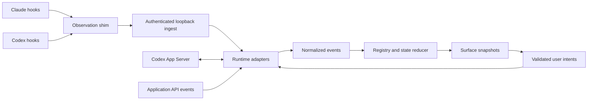

# OpenAI integration: requirements and implementation plan

Status: **proposed**, researched 2026-09-13. No OpenAI adapter is
implemented or enabled by this document. Existing accepted behavior,
phase boundaries, and security rules remain authoritative.

## Purpose and scope

Extend Deckhand so Claude Code and Codex sessions can share the same
pointer-operated board. Reuse the surface, registry, persistence, and
state reducer after extracting runtime-specific parsing. Start with
observation; introduce control only through a separately validated
interface and the existing permission-gate milestones.

This is the proposed implementation path for the second-adapter work in
[ROADMAP.md](../ROADMAP.md#phase-6-beyond-claude-code). It does not reorder
the roadmap. Small evidence-gathering spikes can inform that work without
shipping control capabilities early. The broader scope includes a later
adapter for applications built with OpenAI APIs; arbitrary ChatGPT chat
monitoring is an unresolved integration target.

The existing [adapter protocol](ADAPTER_PROTOCOL.md),
[architecture](ARCHITECTURE.md), [control mapping](CONTROL_MAPPING.md),
[security model](SECURITY_MODEL.md), and
[accessibility requirements](ACCESSIBILITY.md) win if this proposal
conflicts with them. Proposed contract changes below need an ADR and a
protocol revision before implementation changes those contracts.

## Evidence and product boundaries

The code baseline inspected was PR 10 at `731a4cc`. Locally, CLI help
reported `codex-cli 0.154.0-alpha.6.2` and exposed App Server commands and
schema-generation tooling. That verifies tool availability only. No
Codex hook, server connection, approval reply, or window raise was tested
live for this proposal.

The official documentation was checked on 2026-09-13:

- [Codex hooks](https://learn.chatgpt.com/docs/hooks) document lifecycle,
  tool, permission, interruption, and subagent events. Hooks require
  trust. Hosted tools are outside the local tool-hook coverage, and
  transcript format is not a stable interface.
- [Codex App Server](https://learn.chatgpt.com/docs/app-server) documents
  JSON-RPC, thread inventory, status notifications, turn commands, and
  approval requests. The server command and WebSocket transport carry
  experimental limitations. Stored threads and loaded threads are
  different inventories.
- [Responses streaming](https://developers.openai.com/api/docs/guides/streaming-responses)
  documents typed progress, completion, and error events for requests
  an application makes.
- [Plugins](https://developers.openai.com/plugins) expose skills and
  external tools to ChatGPT and Codex. This does not establish an
  interface for monitoring every existing ChatGPT conversation.

| Target | Proposed integration | Release boundary |
| --- | --- | --- |
| Existing local Codex sessions | Trusted command hooks through a small observation shim | Only hosts and versions verified by fixtures and live tests |
| Codex sessions connected to a server Deckhand manages | App Server protocol client | Explicit connection ownership, pinned schema, tested capabilities |
| Application-owned OpenAI API sessions | Events from the application's request and tool lifecycle | Only sessions owned or explicitly exposed by that application |
| Arbitrary existing ChatGPT chats | Research only | No supported discovery/control route established here |

Launching another App Server must not be treated as attaching to all
running Codex clients. Seeing persisted thread history does not prove
that a thread is live, subscribed, controllable, or associated with a
particular window. CLI, IDE extension, desktop, and remote hosts each
need their own entry in the verification matrix.

## Required outcomes

The following are acceptance requirements for the proposed work. They
describe release gates, not claims about current functionality.

| ID | Requirement | Acceptance evidence |
| --- | --- | --- |
| R1 | Mixed runtimes share the existing six-tile surface and frozen state meanings | One test drives three Claude and three Codex sessions without runtime branches in rendering |
| R2 | Session identity includes runtime and stable origin as well as native session ID | Identical native IDs from different runtimes/origins cannot overwrite one another |
| R3 | Discovery distinguishes history, observed activity, and current connection health | A stored thread or lost connection never invents idle, complete, or ended |
| R4 | Existing Claude hooks and saved bindings continue to work | Old payload fixtures and a legacy bindings file retain their prior results |
| R5 | Observation cannot approve, deny, send, interrupt, or change settings | Fake-runtime tests record no action replies or action commands from observation mode |
| R6 | Controls derive from verified per-session capabilities and current state | Unsupported controls stay visible and explain why they cannot act |
| R7 | Click-to-reveal targets an identified host window | Own-window exclusion, stale handles, ambiguous hosts, and absent hosts are covered |
| R8 | Failure and backpressure do not stall the user's runtime | Absent, slow, malformed, overloaded, and restarting daemons produce bounded shim exits |
| R9 | State changes use complete evidence and correlated operations | Duplicate, missing, reordered, interrupted, failed, and child events have explicit expected outcomes |
| R10 | Future approvals require a live, exact, human-selected request | Stale, duplicate, cross-session, cross-connection, and replayed replies are rejected |
| R11 | Persistence and diagnostics preserve privacy and recoverability | Migration rollback, malformed files, redaction, retention, and reconnect tests pass |
| R12 | Setup, recovery, and all shipped controls work with a pointer | Live checklist includes readable errors, no required typing/dragging, and 44 px targets |

## Architecture and ownership



The App Server and API paths are later work packages. The initial hook
adapter only contributes observations. The daemon remains responsible
for state, liveness, binding, and action validation. The surface renders
snapshots and sends user intents; it does not interpret runtime payloads
or decide whether an approval is safe.

An adapter manager owns start, stop, discovery, and refresh. Scan queries
adapters outside the registry lock, reports failures per adapter, and
merges their inventories. A failed or slow Codex adapter must not block
Claude observation or surface input. Cancellation and shutdown must be
bounded and affect only processes/connections owned by Deckhand.

Define a serializable adapter descriptor with protocol version and a
capability ceiling. Each session narrows that ceiling. Evidence should
name interface class, verification status, runtime version, host,
transport, and connection ownership;
documentation alone never makes an action available. Unknown capability
names or unsupported versions must leave controls unavailable.
Bind live control authority to the current connection generation and
recompute it as false after disconnect or unsuccessful reconciliation.

### Session and connection identity

Introduce a structured `SessionKey` with `adapter_id`, `origin_id`, and
`native_session_id`. Serialize it as structured fields rather than
concatenating unescaped strings. A stable origin identifies the runtime
installation, account/workspace boundary where relevant, and machine.
It must not contain a credential or a transient port.

Persist a random Deckhand installation identifier once and preserve it
through upgrades and binding migration. Combine it with an adapter-owned
non-secret profile identifier whose stability and account-switch rules
are defined by W0. Legacy bindings use the same persisted local origin.
Do not derive origin from an executable path, rotating token, or display
name. If origin evidence is unavailable, keep observations separate and
disable automatic cross-source reconciliation. Resetting origin requires
an explicit migration or rebinding path.

Connection generation, process identity, host, and transport are separate
fields. A reconnect increments connection generation without creating a
new saved session. Hook and App Server observations for the same native
session must reconcile to one key only when their common origin is
proven. Otherwise show separate explicitly labeled observations rather
than merging by directory or title.

Store native permission policy and sandbox details separately from the
display label. Similar spellings across runtimes do not establish equal
authority. Any mapping into the existing `PermissionMode` type must be
documented, tested, and conservative; use `unknown` when necessary.
Record observation confidence separately from action capability.

### Normalized event contract

The current implementation calls `Registry::apply_hook` and interprets
Claude hook names in `Session::apply_hook`. Extract that interpretation
into a Claude adapter first, preserving all existing results.

The proposed internal envelope is:

```text
Observation {
  schema_version,
  session_key,
  source_kind,
  connection_generation,
  delivery_id?,
  native_event_id?,
  native_sequence?,
  source_timestamp?,
  received_at,
  event
}
```

Proposed event variants include session metadata, turn start/finish,
operation start/finish, pending input/resolution, child start/finish,
explicit session end, and observation degradation. Include native turn,
item, child, and request IDs where available. Preserve an operation's
outcome separately from the outcome of its enclosing turn.

The reducer consumes these events and emits the existing state enum.
Unknown fields remain forward-compatible; an unknown event must not
invent a transition. Use local monotonic elapsed time for deadlines.
Protocol version 0 uses observation time to resolve reordered updates.
Its revision must define precedence among native sequence, source time,
and receipt order within a source generation, plus conservative conflict
handling across sources. Preserve timestamps rather than discarding
them. Reject provably stale updates; ambiguous concurrent observations
must not silently roll state backward. Source clocks are never
permission deadlines. W1 preserves baseline behavior; any ordering
correction is a separately specified contract change.

Do not fabricate tool correlation IDs from a tool name. If a provider
omits reliable IDs, document the correlation limits and degrade when
concurrent operations cannot be reconciled. Delivery deduplication must
use an actual delivery/native identity; identical payload text can
represent two legitimate calls. A retry must reuse its delivery ID.

The proposed `SessionUpdate` in protocol version 0 lacks explicit
operation lifecycle fields. Document that mismatch and revise the
contract before making the normalized envelope an adapter-facing API.
This document does not silently redefine version 0.

### State mapping rules

| Evidence | Intended interpretation |
| --- | --- |
| Confirmed turn start or active operation | Thinking |
| Current permission request or question | Needs input, with the correct kind when known |
| Confirmed successful turn end and empty required ledgers | Complete and unread |
| Tile selection | Clear complete to idle, as today |
| Confirmed terminal turn failure | Error with typed detail |
| Individual tool failure | Close that operation; do not declare the whole turn failed |
| Interruption | Close affected operations using the existing reducer rules |
| Explicit session end | Ended |
| Lost evidence, connection failure, or unreconciled inventory | Unknown |

App Server runtime idle is not sufficient to mark a turn complete and
unread. A completed tool is not a completed turn. Children must not
silently clear their parent's running state. A closed transport is not
proof that the session ended. Preserve the current liveness timeout
until a separate timing ADR establishes an alternative.

## Observation implementation

### Transport and hook installation

Retain the existing authenticated `POST /hook` endpoint as a legacy
Claude input. Introduce a versioned observation endpoint with explicit
runtime identification for new integrations. Adapter selection comes
from registered shim configuration, never from a tool name or cwd.
Raw Codex JSON must not enter the Claude parser simply because some
hook names happen to match.

Retain localhost binding and the shim's bounded connection and IO waits.
Introduce request-body and queue limits: the current HTTP reader and
daemon event channel are unbounded. Proposed starting budgets for W3 are
1 MiB per request, 32 queued observations with an 8 MiB aggregate raw-byte
budget, and at most eight concurrent readers. These are unmeasured design
limits, subject to the normal contract review and load-test gate before
release. Bound parsing and in-flight memory as well as raw queued bytes.

Reject oversized requests before parsing with 413; use a nonblocking
enqueue and return 503 on overload. The shim still exits promptly and
silently. Best-effort delivery cannot become an unbounded retry loop.
Keep a bounded per-adapter loss flag and counter outside the full queue
so a dropped event cannot also suppress the degradation signal. Report
incomplete coverage and reconcile affected state before trusting it.

The observation shim must exit successfully and leave stdout empty on
every path, including unsupported events and daemon failures. Preserve
the shim's dependency budget and follow the dependency propagation row,
including decision and security documentation. The shim reads only
Deckhand contact/configuration metadata and posts to authenticated
loopback. Runtime discovery and hook installation are separate adapter
and setup responsibilities with their own documented access.

Hook registration must merge with existing Codex configuration, retain
user hooks, be idempotent, and support a backup-backed uninstall that
removes only Deckhand-owned entries. Do not auto-trust an installation
on the user's behalf. Respect managed policy that disables hooks and
present the unsupported state with a pointer-accessible explanation.

Use hooks for events they actually cover. Verify failure fields,
subagent identity, long-running command completion, interrupt behavior,
and permission request cancellation against the installed version.
Capture redacted fixtures; matching Claude hook names do not imply
matching payload semantics. Hosted-tool gaps must appear in capability
and observation documentation rather than being hidden by a heuristic.

In particular, `PostToolUse` reports output, not success: decode
`tool_response` through fixtures for each supported tool/version. Keep
hook delivery health separate from tool outcome. Scope opaque
`tool_use_id` values to their session and turn. Subagent events can carry
the parent's `session_id`, so retain separate child evidence rather than
creating children from that field alone. These are documented behaviors
to validate in W0, not observations from this machine.

### Discovery, recovery, and persistence

Maintain an inventory of sessions actually observed by each adapter.
The UI must label its coverage; a hooks-only inventory is not a claim
to list every currently running Codex session. Cold-start bindings load
as unknown until reconciled with current evidence. Persisted thread
history may enrich metadata but cannot establish liveness.

Version the bindings file before adding `SessionKey`. Migrate each old
string ID to a Claude key on the local origin, preserving tile index
and label. Write through a temporary file and atomic replacement, retain
a recoverable pre-migration copy, and test interruption during migration.
Missing or corrupt data must not erase the original file automatically.
Specify rollback behavior before shipping a format older builds cannot
read. Reconnects must not duplicate tiles or overwrite newer observations.

### Host navigation

Keep host identity independent of runtime identity. Prefer a registered
window association when Deckhand starts or explicitly connects a client.
Validate HWND ownership and process lifetime before reusing a mapping;
numeric PIDs and window handles can be recycled.

Exclude Deckhand's own windows from candidates. An ambiguous match
needs a visible choice or an honest unsupported result. Multiple
sessions in one IDE window must not be presented as independently
focusable tabs unless a supported tab-navigation interface is verified.
An App Server thread without a window needs a separate output viewer
decision; do not advertise Reveal merely because a thread exists.

## App Server and later control

Use a process/connection owned by Deckhand for the first server spike.
Prefer local stdio for that experiment. Pin the executable version and
generate protocol schemas from that executable; commit the intentionally
supported contract or fixture subset according to repository policy.
Record schema provenance and reject unsupported versions with a clear
capability failure. Experimental interfaces remain an explicit risk.

Send `initialize` once per connection, await its response, then send
`initialized` before other methods. Declare client capabilities and leave
experimental opt-ins off initially; this is not evidence of negotiation
of every runtime feature. Implement a JSON-RPC request table,
continuous message reading, typed notifications, and a bounded
queue of server-originated requests. Handle notifications while requests
are outstanding. Do not assume request IDs from different directions
or connection generations share one namespace.

Separate reading stored history, observing a loaded thread, and
starting/resuming work. Establish subscriptions using only a verified
sequence with known side effects. If read-only attachment to an existing
client cannot be proven, restrict the integration to managed sessions.
On reconnect, rebuild authoritative state before reenabling controls;
never replay an action or approval automatically.

Do not assume missed notifications will be replayed. Reinitialize and
reconcile through the supported read/subscription path, keeping pending
outcomes unknown until fresh evidence resolves them.

The first protocol fixture set should cover these documented entry
points; W0 must check them against the pinned executable schema:

| Purpose | Protocol entry points |
| --- | --- |
| History versus current server inventory | `thread/list`, `thread/loaded/list` |
| Read versus start/resume | `thread/read`, `thread/start`, `thread/resume` |
| State and terminal evidence | `thread/status/changed`, `turn/started`, `turn/completed`, `item/completed` |
| Later user actions | `turn/start`, `turn/steer`, `turn/interrupt` |
| Pending request reconciliation | Native approval requests and `serverRequest/resolved` |

### Action and approval requirements

Sending, steering, interruption, question answers, and permission
decisions are distinct capabilities. Each is false until its native
request/response path is tested for the specific host and connection.
The current blanket attached-mode restrictions cannot be removed just
because the server offers commands somewhere else; any generalization
needs an ADR and the control/protocol/security propagation sweep.

Before accepting a future intent, the daemon must verify session key,
current binding revision, connection generation, native request ID,
request revision, scope, and expiry. A tile index alone is insufficient
because its binding can change while a panel is open. Consume successful
decisions once. Resolve races with cancellation and with another client
answering the same request.

Show the actual command, file changes, network scope, or question being
answered. Do not collapse different request classes into a generic
Approve action with broader authority than the visible request. Preserve
native question IDs and option IDs behind readable labels, including
duplicate labels, multiple questions, and free-text-only requests.

Map each reply against the request's permitted native decisions. A
one-time approval must not become a session grant or policy amendment.
Require connection-scoped JSON-RPC identity plus thread, turn, and item
identity where supplied; an acknowledgement is not proof of successful
execution. Keep resolution and final operation outcome separate. A
network-scope request needs a network-specific preview and decision.

There is no assumption that Deckhand's `ask` has a native equivalent in
every protocol. Establish a tested handback/cancellation path that
retains a native human prompt. If that cannot be done without expanding
authority, keep the control capability disabled. Timeout, malformed
messages, disconnect, restart, or missing UI must never produce allow.
Observation transport failure and permission decision failure have
different recovery rules and must remain separate code paths.

Credentials stay in the runtime's supported authentication store. Prefer
existing supported sign-in for the server experiment; do not duplicate
tokens into bindings, hook arguments, logs, or snapshots. A later API
adapter needs separate credential and billing configuration. No billable
API calls or authentication changes are part of this planning change.

## Work packages and release gates

These package numbers are not replacements for the repository phases.
Each package should land as a reviewable change with its own evidence.

| Package | Implementation | Exit gate |
| --- | --- | --- |
| W0: evidence | Versioned redacted Codex fixtures, host matrix, generated schema inspection | Documented fields distinguished from live observations; unresolved discovery and request semantics listed |
| W1: common reducer | Extract Claude parser, introduce internal events, preserve legacy ingest | All existing state/pipeline/shim tests retain their results; no control changes |
| W2: identity | Add runtime/origin keys, adapter registry, versioned bindings migration | Collision, restart, mixed inventory, and rollback tests pass |
| W3: Codex observation | Install/uninstall hooks, versioned ingest, Codex parser, degraded-state reporting | Three Claude and three Codex sessions on one board; zero control authority |
| W4: server observation | Owned stdio connection, pinned protocol, inventory/subscription reconciliation | Fake-server failure suite and isolated live observation pass; external attachment remains false unless proved |
| W5: controls | Separate ADRs and the existing permission gate before native actions | Human intent binding, stale/replay rejection, and safe handback tests pass per capability |
| W6: API applications | Application-owned session adapter and explicit cost/credential configuration | Documented application lifecycle and tool-approval boundary; no claim to control arbitrary ChatGPT chats |

W1 precedes W2 and W3. W4 can be researched alongside W3 but must use the
same identity and event contract before it ships. W5 depends on both
the server evidence and the project's existing control/security phases.
Stop at the preceding observation gate when native control semantics
remain unresolved. Do not estimate calendar delivery before W0 resolves
the host and payload uncertainties.

### Planned code changes

Paths below are proposed locations; files named as new do not exist yet.

| Area | Planned change |
| --- | --- |
| `app/src-tauri/src/adapters/` (new) | Adapter lifecycle, Claude parser, Codex hook parser, later server client |
| `app/src-tauri/src/events.rs` (new) | Internal normalized event and identity types, schema version checks |
| `app/src-tauri/src/state.rs` | Runtime-neutral reducer and operation/input/child ledger behavior |
| `app/src-tauri/src/registry.rs` | Composite keys, inventory coverage, source reconciliation, snapshot capabilities |
| `app/src-tauri/src/http.rs` | Versioned observation routing, bounded queues, validation and diagnostics |
| `shim/src/main.rs` | Explicit configured runtime route with legacy compatibility and bounded delivery |
| `app/src-tauri/src/persist.rs` | Versioned binding format, migration, recovery and rollback |
| `app/src-tauri/src/main.rs` | Adapter startup/shutdown and validated intent dispatch |
| `app/src-tauri/src/reveal.rs` | Host associations, own-window exclusion and ambiguity handling |
| `app/ui/src/types.ts` and `app/ui/src/main.ts` | Session provenance, capability reasons and request-bound intents |
| `scripts/` | Reversible hook registration and evidence-capture helpers |
| `app/src-tauri/tests/`, `shim/tests/`, `app/ui/test/` | Fixture, migration, protocol, mixed-session and interaction checks |

Do not add provider-specific behavior to glyphs, state colors, or common
control labels. Runtime provenance and capability reasons belong in
session metadata, the picker, and the detail panel. Distinguish equal
session labels by runtime and origin without relying on color. Replace
the current hardcoded attached label and Claude-only blocked reasons
with these fields. Production setup must be usable
with a pointer; development scripts alone do not satisfy R12.

## Validation and operational requirements

Use deterministic fixtures and fake transports before live tests:

- Replay every existing Claude fixture through the extracted adapter
  and compare state, detail, operation ledger, child ledger, and unread
  transitions with the baseline. Include restart and resume.
- Exercise Codex success, tool failure, terminal failure, cancellation,
  unknown events, duplicate deliveries, missing closes, out-of-order
  arrivals, parallel same-name tools, and parent/child completion.
- Drive six mixed sessions through real loopback ingest. Verify binding
  collision isolation and independent state changes. Include a session
  with unsupported coverage and require unknown rather than a guess.
- Run fake App Server cases for handshake failure, partial JSON lines,
  oversized/malformed frames, interleaved replies, request timeout,
  disconnect during a turn, reconnect with old replies, and unknown
  notification variants. Keep the reader alive under a blocked caller.
- Assert no outbound action in observation mode. For future controls,
  test each native approval kind, cancellation, expiry, double click,
  rebinding during a prompt, reconnect, duplicate labels, and another
  client resolving the request first.
- Cover the PR 10 review scenarios in future UI/window work: saved
  coordinates on a removed monitor, expansion near screen edges,
  self-matching Reveal, unrelated updates while scrolled, and repeated
  Back. Also test display scale and multiple windows for one workspace.
- Measure shim wall time with an absent/slow daemon, ingestion-to-tile
  latency, queue loss under load, daemon idle CPU/memory, and restart
  recovery. Record sample size, hardware, versions, and percentiles;
  agree budgets before claiming a performance gate passes.

Keep ordinary CI offline with respect to OpenAI services. Fixtures must
contain no tokens, full user prompts, private paths, or unredacted tool
output. Logs should default to operational IDs, outcome, version, and
timing, with bounded size/retention. Raw capture is opt-in and its
retention/deletion policy must be recorded before a live spike.

Live evidence must name the exact CLI/client build, host type, tool path,
transport, and observed capability. One host passing does not upgrade
another. Coordinate any desktop interaction with the user; never steal
focus during background verification or terminate unrelated processes.

## Documentation and decision gates

Before implementing W1, reconcile the proposed event contract with
protocol version 0 and record the accepted boundary in an ADR. Before
W2 ships, document identity, migration, and rollback. Before W4/W5 ship,
decide connection ownership, supported versions, native handback,
question identity, and capability changes in separate coherent ADRs.
Any new timeout, dependency, host kind, or authentication mechanism
requires its applicable propagation-table review.

Add `docs/CODEX_ADAPTER.md` with a per-host/per-version verification
matrix when W0 has fixtures. Update the adapter protocol, architecture,
security model, control mapping, UI spec, accessibility rules, and
changelog as their corresponding contracts change. Never upgrade a
capability from documented to observed based on schema generation alone.

This planning change adds no capability, timing, dependency, control, or
permission behavior. Its sync-check class is an implementation proposal:
the adapter and architecture docs link to it, the security model records
its scope, and the roadmap/task list track work that remains open.
Existing ADRs and phase gates are unchanged.
